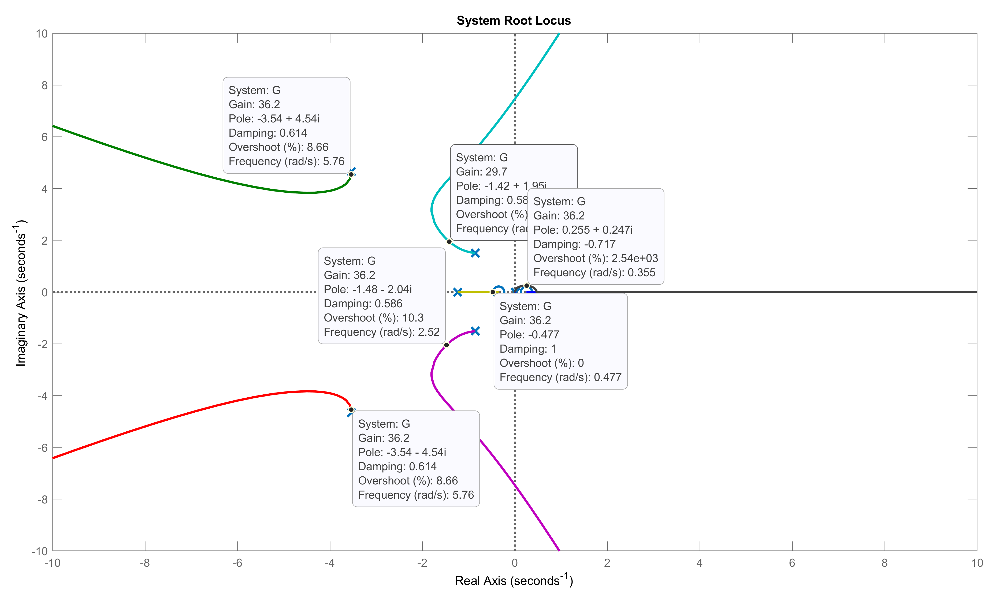
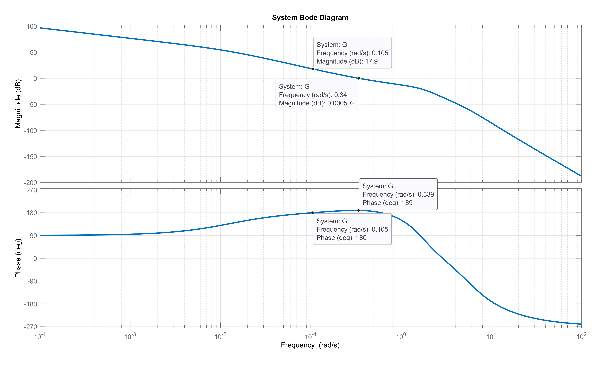
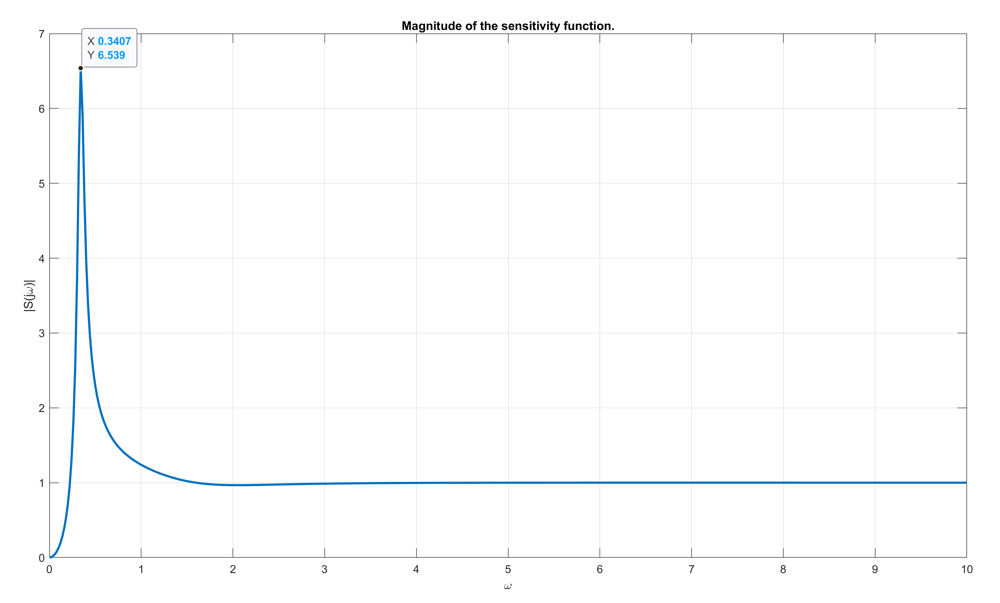

# PART A

We first deconstruct the plant transfer function as $P = \frac{N_P}{D_P}$ where:
$$
N_P = q_0s+q1, \qquad D_P = r_0s^6+r_1s^5+r_2s^4+r_3s^3+r_4s^2+r_5s+r_6
$$
The four _Kharitonov polynomials_ for $N_P$ are:
$$
N_1 = q^{-}_{0} s + q^{-}_{1}, \quad N_2 = q^{+}_{0} s + q^{+}_{1}, \quad N_3 = q^{+}_{0} s + q^{-}_{1}, \quad N_4 = q^{-}_{0} s + q^{+}_{1}
$$
Similarly, the four _Kharitonov polynomials_ for $D_P$ are:
$$
\begin{gathered}
D_1 = r^{+}_{0} s^{6} + r^{-}_{1} s^{5} + r^{-}_{2} s^{4} + r^{+}_{3} s^{3} + r^{+}_{4} s^{2} + r^{-}_{5} s + r^{-}_{6}
\\
D_2 = r^{-}_{0} s^{6} + r^{+}_{1} s^{5} + r^{+}_{2} s^{4} + r^{-}_{3} s^{3} + r^{-}_{4} s^{2} + r^{+}_{5} s + r^{+}_{6}
\\
D_3 = r^{+}_{0} s^{6} + r^{+}_{1} s^{5} + r^{-}_{2} s^{4} + r^{-}_{3} s^{3} + r^{+}_{4} s^{2} + r^{+}_{5} s + r^{-}_{6}
\\
D_4 = r^{-}_{0} s^{6} + r^{-}_{1} s^{5} + r^{+}_{2} s^{4} + r^{+}_{3} s^{3} + r^{-}_{4} s^{2} + r^{-}_{5} s + r^{+}_{6}
\end{gathered}
$$
We then deconstruct the controller transfer function as $C = \frac{N_C}{D_C}$ where $N_C = K - 4s$ and $D_C = s$.

Since the controller is of $1^{st}$ order, we can utilize the _16-plant theorem_ to write the _16-plant polynomials_ $e_{1-16}$ as:
$$
e_i = N_C N_{i_1} + D_C D_{i_2}
$$
where $i_1 \in \{1, 2, 3, 4\}$ and $i_2 \in \{1, 2, 3, 4\}$.

For example, the first polynomial is:
$$
\begin{gathered}
e_1(s) = N_C N_1 + D_C D_1 
\\
= (K-4s)(q^{-}_{0} s + q^{-}_{1}) + s(r^{+}_{0} s^{6} + r^{-}_{1} s^{5} + r^{-}_{2} s^{4} + r^{+}_{3} s^{3} + r^{+}_{4} s^{2} + r^{-}_{5} s + r^{-}_{6})
\\
= s^{7} + 9 s^{6} + 50 s^{5} + 150 s^{4} + 200 s^{3} + 116.2 s^{2} + \left(0.95 K - \delta - 1.4\right) s + 0.35 K
\end{gathered}
$$
The _16-plant theorem_ states that for the system to be _robustly stable_ all 16 polynomials should be stable. We can construct the _Routh arrays_ for each polynomial to check for stability (all the elements of the first column should be greater than zero). For example, the first _Routh array_ is:
$$
\tiny \left[\begin{matrix}1 & 50 & 2 \cdot 10^{2} & 0.95 K - 1 \delta - 1.4\\9 & 1.5 \cdot 10^{2} & 1.2 \cdot 10^{2} & 0.35 K\\33 & 1.9 \cdot 10^{2} & 0.91 K - 1 \delta - 1.4 & 0\\1 \cdot 10^{2} & - 0.25 K + 0.27 \delta + 1.2 \cdot 10^{2} & 0.35 K & 0\\082 K - 09 \delta + 1.5 \cdot 10^{2} & 0.79 K - 1 \delta - 1.4 & 0 & 0\\\frac{- 79 K + 1 \cdot 10^{2} \delta + \left(- 0.25 K + 0.27 \delta + 1.2 \cdot 10^{2}\right) \left(082 K - 09 \delta + 1.5 \cdot 10^{2}\right) + 1.4 \cdot 10^{2}}{082 K - 09 \delta + 1.5 \cdot 10^{2}} & 0.35 K & 0 & 0\\\frac{018 K^{3} - 061 K^{2} \delta + 93 K^{2} + 067 K \delta^{2} - 2.2 \cdot 10^{2} K \delta - 6.3 \cdot 10^{3} K - 024 \delta^{3} + 1.3 \cdot 10^{2} \delta^{2} + 1.8 \cdot 10^{4} \delta + 2.4 \cdot 10^{4}}{02 K^{2} - 044 K \delta + 1.1 \cdot 10^{2} K + 024 \delta^{2} - 1.3 \cdot 10^{2} \delta - 1.7 \cdot 10^{4}} & 0 & 0 & 0\\0.35 K & 0 & 0 & 0\end{matrix}\right]
$$
We have to construct all 16 arrays and solve for all the first columns to be greater than zero. I was able to achieve this with the combination of `sympy` and `Mathematica`. However, since we cannot solve the inequalities with both of the two unknowns $K$ and $\delta$, an iterative approach was taken where we find the interval $K$ should be in for given values of $\delta$.

For example, starting with $\delta = 0$, I found that $6.53978 < K < 47.1073$. However $\delta = 5$ yielded no possible solutions. After a number of trials, I have reached the maximum value of $\delta = 3.156$, where the range is $30.5957 < K < 30.653$. So the values $\delta = 3.156$ and $K = 30.6$ satisfy the stability conditions.

# PART B

Using `MATLAB`, I can plot the of the feedback system $G(s)$ using the controller given $C(s)$ and plant $P(s)$, plugging in the value $\delta_{max} = 3.156$ found in **PART A**.

# PART C

Using the values $\delta = 3.156$ and $K = 30.6$, the system transfer function becomes:
$$
G(s) = \frac{-4 s^2 + 29.2 s + 10.71}{s^7 + 10 s^6 + 60 s^5 + 140 s^4 + 200 s^3 + 125 s^2 - 1.578 s}
$$

To find the stability margins, I have plotted the Bode diagram for the system using `MATLAB`.

\newpage

The gain margin can be calculated by first finding the frequency $\omega_g$ where the phase is $180 ^\circ$ and finding 0 plus the gain at that frequency. As can be seen in *Figure 2*, this happens at $\omega_c = 0.105$, where the gain is $17.9 dB$: this means the gain margin is $GM = 17.9 \space dB$.

For the phase margin, I first find the frequency $\omega_p$ where the gain is 0 dB, and find the phase at that frequency. *Figure 2* shows that this happens at $\omega_p = 0.34$, where the phase is $-189 ^\circ$, meaning the phase margin is $PM = -189+180 = 9 ^\circ$.

For the delay margin, I need to find what this phase shift corresponds to in the time domain. It is given by the expression $\frac{PM}{\omega_p} = \frac{\text{deg2rad}(9)}{0.34} = 0.462s$.

\newpage

Given the system transfer function $G(s)$, the _sensitivity function_ is defined as:
$$
S(s) = \frac{1}{1+G(s)}
$$
Using the values $\delta = 3.156$ and $K = 30.6$, this corresponds to:
$$
S(s) = \frac{s^7 + 10 s^6 + 60 s^5 + 140 s^4 + 200 s^3 + 125 s^2 - 1.578 s}{s^7 + 10 s^6 + 60 s^5 + 140 s^4 + 200 s^3 + 121 s^2 + 27.62 s + 10.71}
$$
Substituting $s=j\omega$ and plotting the complex magnitude depending on the frequency $\omega$ using `MATLAB` produces the following figure:

As can be seen, the sensitivity function $S(s)$ reaches it's peak value of $6.539$ at $\omega=0.3407$.

