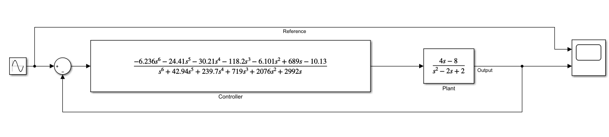
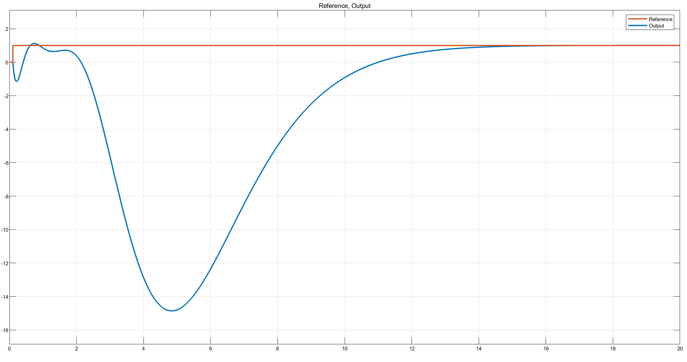
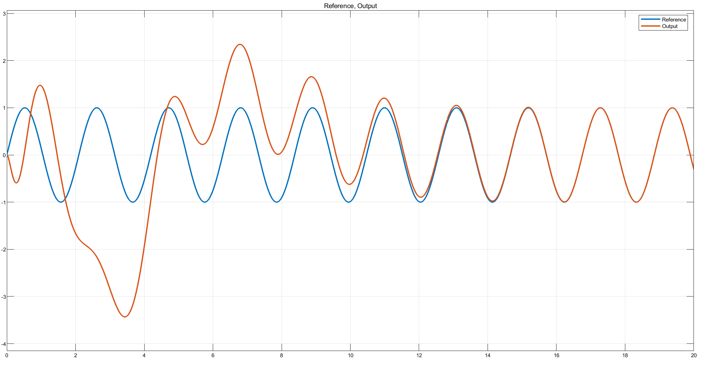

# Problem 1

## Part A

To find the controllers stabilizing the feedback system $(C, P)$ we first find the coprime-factorization $P(s)$ as:
$$
P(s) = \frac{s^{2} - 2 s + 2}{s^{2} + 2 s + 1} = \frac{N(s)}{D(s)}
$$


where $N(s)$ and $D(s)$ are co-prime polynomials.

To do this, we first transform $P(s)$ to $\bar{P}(k)$ under the mapping $s = \frac{a-k}{k}$. where $a >0$. This mapping works because any polynomial in $k$ then is a proper rational transfer function with the poles at $-a$, since the inverse mapping is $k = \frac{1}{s+a}$. Let us choose $a=1$, thus the mapping is $s = \frac{1-k}{k}$.
$$
\bar{P}(k) = - \frac{12 k^{2} - 4 k}{5 k^{2} - 4 k + 1}
$$

We then write $\bar{P}(k)$ as a ratio of two co-prime polynomials $n(k)$ and $d(k)$. So,
$$
n(k) = - 12 k^{2} + 4 k, \quad p(k) = 5 k^{2} - 4 k + 1
$$
Then, we find the polynomials $x(k)$ and $y(k)$ satisfying the equation $nx + dy = 1$. Using Euclid's algorithm, we arrive at:
$$
x(k) = 4.375 k - 1.625, \quad y(k)=10.5k + 1
$$
Using the inverse-mapping $k = \frac{1}{s+1}$: we find the transfer functions as:
$$
\begin{gathered}
N(s) = \frac{4 \left(s - 2\right)}{s^{2} + 2 s + 1}, \quad D(s) = \frac{s^{2} - 2 s + 2}{s^{2} + 2 s + 1} \\
X(s) = \frac{2.75 - 1.625 s}{s + 1}, \quad Y(s) = \frac{s + 11.5}{s + 1}
\end{gathered}
$$


Thus, by the Youla parametrization theorem, the set of all controllers stabilizing the feedback system $(C,P)$ can be characterized as:
$$
\begin{gathered}
\mathcal{C}(P) = \left\{\frac{X + DQ}{Y - NQ} = \frac{\frac{Q \left(s^{2} - 2 s + 2\right)}{s^{2} + 2 s + 1} + \frac{2.75 - 1.625 s}{s + 1}}{- \frac{4 Q \left(s - 2\right)}{s^{2} + 2 s + 1} + \frac{s + 11.5}{s + 1}} \right\} \\
\\
= \frac{Q\left(1.0 s^{2} - 2.0 s + 2.0\right) - 1.625 s^{2} + 1.125 s + 2.75}{Q \left(8.0 - 4.0 s\right) + 1.0 s^{2} + 12.5 s + 11.5}
\end{gathered}
$$

\newpage


## Part B

The steady state performance conditions state that:

* for $R(s) = \frac{1}{s}$, $e_{ss} = 0$ &rarr; $C$ has a pole at $s=0$
* for $r(t) = sin(3t), R(s) = \frac{3}{s^2 + 9}$, $e_{ss} = 0$ &rarr; $C$ has poles at $s=\pm 3j$

Let us define the denominator of $C$: $Y - NQ$ as $\Psi(s)$, then we have the three conditions:

* $\Psi(0) = 0$
* $\Psi(3j) = 0$
* $\Psi(-3j) = 0$

Noting that $Q$ must be in the form:
$$
Q(s) = \frac{q_2s^2 + q_1s + q_0}{(s+3)^2}
$$
we solve these three equations with three unknowns $q_2, q_1, q_0$ as follows:
$$
\begin{gathered}
\Psi(s) = - \frac{4 \left(s - 2\right) \left(q_{0} + q_{1} s + q_{2} s^{2}\right)}{\left(s + 3\right)^{2} \left(s^{2} + 2 s + 1\right)} + \frac{s + 11.5}{s + 1} \\
\Psi(0) = \frac{8 q_{0}}{9} + 11.5 = 0 \\
\Psi(3j) = - \frac{\left(-8 - 6 i\right) \left(-2 + 3 i\right) \left(q_{0} + 3 i q_{1} - 9 q_{2}\right)}{25 \left(3 + 3 i\right)^{2}} + \frac{\left(1 - 3 i\right) \left(11.5 + 3 i\right)}{10} = 0\\
\Psi(-3j) = - \frac{\left(-8 + 6 i\right) \left(-2 - 3 i\right) \left(q_{0} - 3 i q_{1} - 9 q_{2}\right)}{25 \left(3 - 3 i\right)^{2}} + \frac{\left(1 + 3 i\right) \left(11.5 - 3 i\right)}{10} = 0
\end{gathered}
$$
The solutions are:
$$
q_0: -12.9375, \quad q_1 = 12.4038, \quad q_2 = -4.61058
$$
Thus $Q$ is:
$$
Q(s) = \frac{- 4.61058 s^{2} + 12.4038 s - 12.9375}{\left(s + 3\right)^{2}}
$$
Plugging this $Q(s)$ to the equation for the controller $C$, we finally arrive at:
$$
C(s) = \frac{- 6.236 s^{6} - 24.41 s^{5} - 30.21 s^{4} - 118.2 s^{3} - 6.101 s^{2} + 689.0 s - 10.13}{1.0 s^{6} + 42.94 s^{5} + 239.7 s^{4} + 719.0 s^{3} + 2076 s^{2} + 2992 s}
$$

\newpage

I have also implemented this system in *Simulink* to show that the steady state performance conditions are satisfied.



{width=60%}

{width=60%}

As both Figures 2,3 show, the error approaches zero around after 14 seconds, so the steady state error is 0.

\newpage

# Problem 2

## Part A

From Problem 1 we have:
$$
\begin{gathered}
N(s) = \frac{4 \left(s - 2\right)}{s^{2} + 2 s + 1}, \quad D(s) = \frac{s^{2} - 2 s + 2}{s^{2} + 2 s + 1} \\
X(s) = \frac{2.75 - 1.625 s}{s + 1}, \quad Y(s) = \frac{s + 11.5}{s + 1}
\end{gathered}
$$

We know that the robust stability condition requires:
$$
|| W_m T||_{\infty} \leq 1
$$

where $W_m$ is the multiplicative uncertainty bound and $T$ is the complementary sensitivity function. It is given that $W_m = \delta (s+1)$. We also know that $T = N(X + DQ)$. Thus the robust stability condition becomes:

$$
|| \delta (s+1) N (X + DQ_c) || _{\infty} \leq 1
$$

Taking the constant $\delta$ outside, we arrive at:
$$
\delta _{max} = \frac{1}{\gamma_{opt}}
$$

where
$$
\gamma_{opt} = \inf_{Q \in H_\infty} || (s+1)N (X + DQ_c) || _{\infty}
$$

We then transform this expression to the form:
$$
\gamma_{opt} = \inf_{Q \in H_\infty} || W - MQ || _{\infty}
$$

using inner-outer factorization, after the necessary computations we arrive at:
$$
M(s) = \frac{s^{2} - 2 s + 2}{s^{2} + 2 s + 1}, \quad W(s) = \frac{4 \left(2.75 - 1.625 s\right) \left(s - 2\right)}{s^{2} + 2 s + 1}, \quad Q(s) = Q_c(s)\frac{-4(s-2)}{s+1}
$$


To solve this using the _Nevallina-Pick interpolation_, we must construct the vectors $a$ and $b$. The vector $a$ is the zeros of $M$, which are $(1 \pm j)$. Thus $a = [\alpha_1, \alpha_2] = [1 + j, 1- j]$. The `b` vector is the value of $W$ at these points, thus $b = [W(\alpha_1), W(\alpha_2)] = [2+j, 2-j]$. Plugging these values into the script `NevPickNew.m`, with

```OCTAVE
>> a = [1+j, 1-j]; b = [2+j, 2-j];
>> [gopt, Qopt] = NevPickNew(a,b)
```

yields the results:
$$
\gamma_{opt} = 3.4495, \quad Q_{opt}(s) = \frac{3.4495 (s - 0.4495)}{s + 0.4495}
$$

Thus,
$$
Qc_{opt} = Q_{opt}\frac{s+1}{-4(s-2)} = - \frac{\left(s + 1\right) \left(3.4495 s - 1.55055025\right)}{\left(s + 0.4495\right) \left(4 s - 8\right)}
$$

Substituting this value of $Qc_{opt}$ in the expression for the controller $C$, we arrive at the optimal controller $C_{opt}$:
$$
C_{opt}(s) = \frac{X + DQ_c}{Y - NQ_c} = \frac{- 9.95 s^{4} + 19.6 s^{3} + 8.32 s^{2} - 28.0 s - 6.79}{4.0 s^{4} + 57.6 s^{3} - 55.1 s^{2} - 138.0 s - 28.9}
$$

# References

Ozbay, Hitay. "Introduction to Feedback Control Theory", Ohio State University.

Arnau, Carles Batlle. "Lecture 4 - Stabilization Slides", Polytechnic University of Catalonia.

\newpage

# Appendix

The code is written in `python3`, using the environment *JupyterLab* and requires the package `sympy`.

```PYTHON
import sympy as sp

from sympy import I as j
from sympy import latex
from sympy import gcdex

# Problem 1

## Part A

s, k, Q = sp.symbols('s k Q')
P = (4 * (s - 2)) / (s**2 - 2*s + 2) 

# Transform $P(s)$ to $\bar{P}(k)$ under the mapping $s = \frac{1-k}{k}$ 

P_bar = P.subs({s: (1-k)/k}).factor().cancel() 

n = P_bar.as_numer_denom()[0] 
d = P_bar.as_numer_denom()[1] 

# Using Euclid’s algorithm, find polynomials $x(k)$, $y(k)$ such that $nx + dy = 1$
x, y, _ = gcdex(n.as_poly(), d.as_poly())

x = (35/8)*k - 13/8 
y = (21/2)*k + 1 

N = n.subs({k: 1/(s+1)}).simplify() 
D = d.subs({k: 1/(s+1)}).simplify() 

X = x.subs({k: 1/(s+1)}).simplify() 
Y = y.subs({k: 1/(s+1)}).simplify() 

# by the Youla-Kucera parametrization theorem:
_C = (X + D*Q) / (Y - N*Q) 
C = _C.cancel().simplify().collect(Q) 


## Part B

q0, q1, q2 = sp.symbols('q0 q1 q2')

Q_ = (q2*s**2 + q1*s + q0) / ((s+3)**2) 

Psi = Y - N*Q_ 

eq1 = Psi.subs({s: 0}) 
eq2 = Psi.subs({s: 3*j}) 
eq3 = Psi.subs({s: -3*j}) 

sol = sp.solve([eq1, eq2, eq3], [q0, q1, q2]) 

Q_sol = Q_.subs({q0: -12.9375, q1: 12.4038, q2: -4.61058}) 

C_ = sp.N(C.subs(Q, Q_sol).cancel().collect(s), 4)
C_sol = C_.as_numer_denom()[0] / C_.as_numer_denom()[1] 

# Problem 2

## Part 1

Q_c = sp.symbols('Q_c')

W = (s+1)*X*N.collect(s) 
W.subs(s, 1-j).simplify()

term2 = (s+1)*N*(D*Q_c).factor() 

M = (s**2 - 2*s + 2) / (s**2 + 2*s + 1) 

Q_opt = (3.4495*(s - 0.4495)) / (s + 0.4495) 
Q_copt = Q_opt * ((s+1)/(-4*(s-2))).cancel() 

Q = sp.symbols('Q')
Copt = sp.N(C.subs(Q, Q_copt).simplify(), 3) 
```
